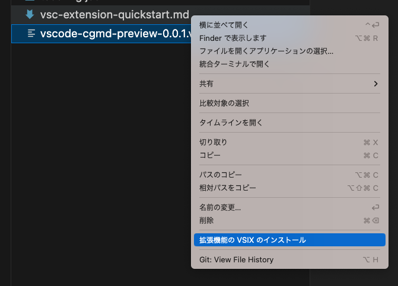

# vscode-cgmd-preview


CodeGrid の原稿用.md をプレビューするための拡張機能です。

## インストール

```bash
npm i
npm run package
```

vscode-cgmd-preview-0.0.1.vsix が生成されるので、「拡張機能の VSIX のインストール」を選びインストールする。



## 実行方法

`.md`ファイルを開く、もしくは、`.md`ファイルを開きアクティブにした状態で、CMD + Shift + P でコマンドパレットを開き、`CGMD: Preview`を選択する。
